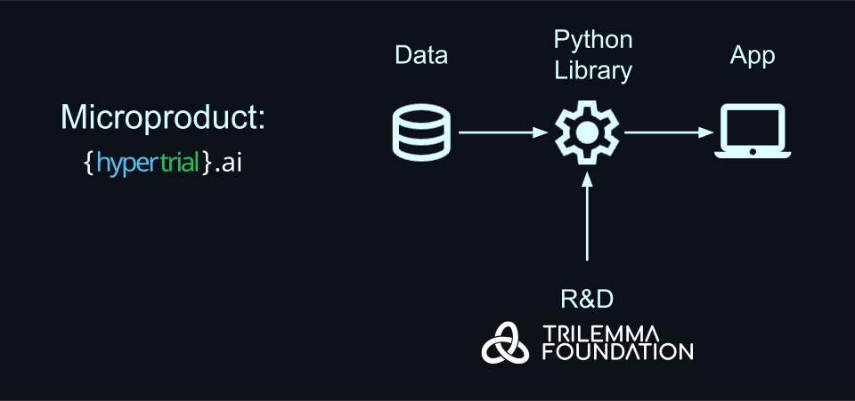

# Recruitment Analytics Initiative 

Welcome to the open source commons for the [Hypertrial.ai](https://www.hypertrial.ai/) [Honest Roles](https://www.honestroles.com/) microproduct. Maintained by Trilemma Foundation, this repository is the gateway to making contributions to the product.

---

<table width="100%" style="background-color:#E6F7FF; text-align:center; table-layout:fixed;">
  <tr>
    <td>
      

        Open Source
      

      

        Built by technical talent, for technical talent.
      

    </td>
    <td>
      

        AI Powered
      

      

        Save valuable time while job hunting.
      

    </td>
    <td>
      

        Honest Job Board
      

      

        Priotizing talent outcomes over all else.
      

    </td>
  </tr>
</table>

---

## Honest Roles

**Take Control of Your Career**  
An LLM-powered job board built by technical talent for technical talent.

---

### The Problem

Technical job discovery is highly inefficient.

Traditional job boards create noise, missed opportunities, and poor matches:

- Roles can be outdated, duplicated, or no longer active (False positives)  
- Left out location and eligibility constraints can make many listings infeasible (False positives)
- Relevant roles are missed due to narrow title searches (False negatives)  

At the same time, a negative feedback loop is emerging:

- Job postings are increasingly AI-generated and keyword optimized  
- Candidates tailor resumes to match keywords instead of real skills  
- Automated tools mass-submit templated applications  
- Recruiters receive overwhelming low-signal submissions  

**Result:** AI-generated postings → AI-optimized resumes → AI-filtered pipelines → declining signal for everyone.

---

### The Solution

**Honest Roles** restores signal to job discovery.

- Sources roles directly from applicant tracking systems (ATS) for freshness and authenticity  
- Uses LLM inference to:
  - Filters stale, duplicate, and infeasible listings  
  - match candidates by skills and capabilities, not just job titles
  - Surfaces relevant opportunities candidates would otherwise miss  
  - Apply objective ranking to highlight high-signal roles  
- Open-sources the ranking methodology for transparency  

---

### Mission

Reduce noise. Increase signal. Break the AI noise loop.  
Help technical talent discover opportunities that truly match their skills and goals.

---

## 🚀 Find How You Will Contribute

| Path                                  | Description                                                                             | Link                                                                                  |
|---------------------------------------|-----------------------------------------------------------------------------------------|---------------------------------------------------------------------------------------|
| **🎓 University Capstones**           | Trilemma Foundation capstone projects hosted at leading STEM programs worldwide. | [Jump to University Capstone Projects](#university-capstone-projects)                                       |
| **🔓 Contribute Open Source**         | Contribute to the main logic powering our microproduct via our Honest Roles python library. | [https://github.com/hypertrial/honestroles](https://github.com/hypertrial/honestroles)                                                    |
| **🏆 Tournaments**                    | Global, free-to-enter competitions. Prove your performance in public. | [Jump to Tournaments](#tournaments)                               |

  

---

## University Capstone Projects

[Trilemma Foundation](https://www.trilemma.foundation/) sponsors capstone, practicum, and internship projects with leading STEM programs around the world. Students contribute to open-source research, receive mentorship, and build a public portfolio of industry work.  

We are working to host Recruitment Analytics casptone projects soon!  

👉 [View other capstone projects or inquire about collaborating](https://www.trilemma.foundation/projects).  

---

## Contribute Open Source

The **honestroles Python library** is the core logic powering our microproduct. It's open source, actively maintained, and designed for contributors of all skill levels.

This is your chance to:

- Contribute to production-grade code used in real-world recruitment analytics
- Work with modern Python development practices and tools
- Build your portfolio with meaningful open source contributions
- Collaborate with a global community of developers and researchers

👉 [**Start contributing to honestroles**](https://github.com/hypertrial/honestroles)

---

## Tournaments

Tournaments are **equal-opportunity competitions** where talent proves itself, and gets directly rewarded.

📢 Visit [trilemma.foundation/tournaments](https://www.trilemma.foundation/tournaments) to stay up to date with the latest tournaments

---
